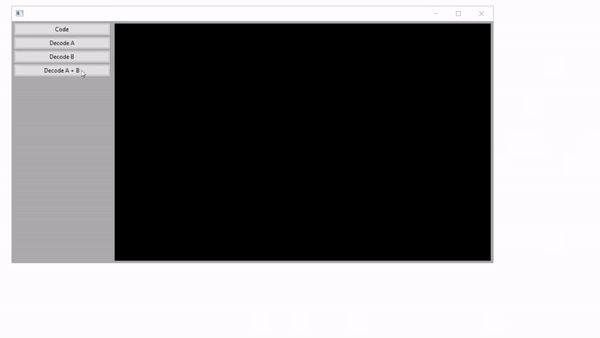

# Image Encryption
### _Application for encrypting and decrypting messages_

The application allows you to encrypt information in images using their modified data, as well as decrypt information from encrypted images. Pictures can be encoded using both steganographic and cryptographic methods.

